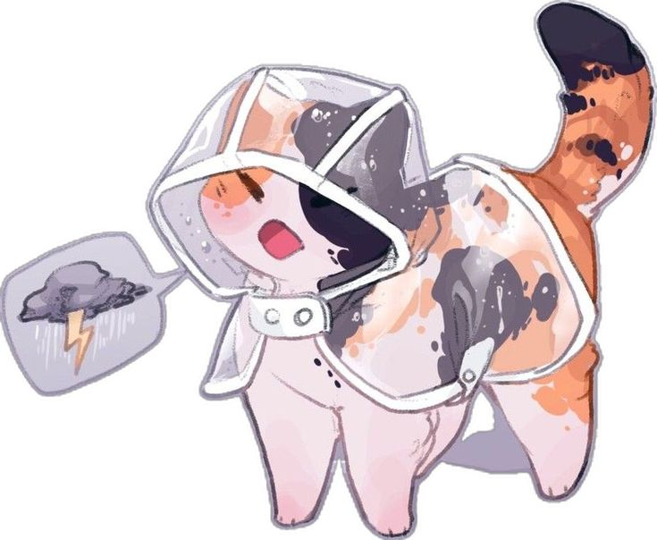

# Not-baguette.github.io

  

Hi! Welcome to my corner of internet! Feel free to explore and get cozy heree!

### About This Page ♡
This page is my third iteration of making a proper website. Thus it is codenamed V3. Alongside that, V3 will get a codename `Calico`, Which fits the image and color theme I've used! ⸜(｡˃ ᵕ ˂ )⸝♡

It's been quite a long journey, V1 was a basic HTML/CSS app. Talking about Baguettes and how they're quite nice. It was meant to be a silly website that's simple and runs on any device, even ES6. It was built for a High school assignment. Even quoting [This website](https://motherfuckingwebsite.com/) :b

I also made a few websites as a [quick tech support](https://github.com/Not-Baguette/not-baguette.github.io/tree/v2-last-ver/legacy) for my time in XDA community, helping people to fix their phones and such.

Then I've learned more about Javascript and HTML Frameworks like Bootstrap 5. Which I used to overhaul my website into a fully responsive page with parallax and V1 still somewhat accessible, or somewhat of it. Though the design is terrible, this is what I considered to be V2. T-T

At this time as well, I was developing a game for my [Midterms](https://github.com/Not-Baguette/not-baguette.github.io/tree/v2-last-ver/timeless), which was called Timeless. I started learning how to use React. It is used to fully make my [final project](https://github.com/Not-Baguette/Thornsoul) for semester 2! (˶ᵔ ᵕ ᵔ˶)

Now we reached the final destination, V3. ◝(ᵔᗜᵔ)◜ This website took me less than a day to make, ALTHOUGH it was intense coding and debugging for an entire day. I don't really plan to update it that much anymore as uni is taking a lot of time and effort. Thus I made nearly everything (Except organizations and Skills) to be dynamic and able to be updated without any effort or changes in code. I used React + TS (I FORGOT TO USE TAILWIND AGAIN) to make the entire thing. I also learned how to design a bit from my friends, I tried implementing the 60-30-10 rule and make a moodboard for it and it somewhat works! I like this website design way more than any website I made before!

Also, I integrated Steam, Spotify, and GitHub APIs to make the entire thing more dynamic, and also, I managed to make a free guestbook. I originally wanted to make a guestbook out of a mysql db but I found myself trying too hard to find a free VPS/DB, so I decided to get creative and realized I could've just used Google Form > Google Sheets > Import the data to my website from the Sheets (CSV format) >:D

That's all I wanted to share with you guys! Thank you for reading and I hope you guys find this website to be a good inspiration!

Signing off,
Bagu ♡

### Credits ♡
I thank the following people for helping me with the development of this website:
- Boni, for helping me pick between designs.
- Naomi, for teaching me some basic designs, helping me pick and pointing out design flaws.
- Eric, for pointing out design faults in my website and giving me recommendations on how to make it better

### Copyright ♡

The images used are not mine, the images are used for non-commercial purposes and personal study.