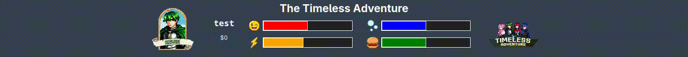
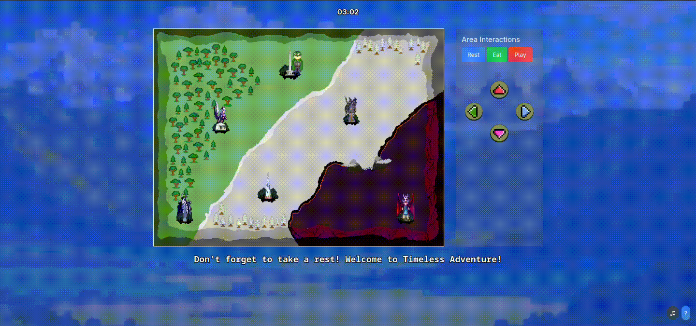
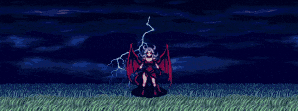
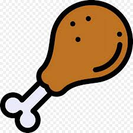

<h1>Timeless Adventure</h1>

<h2><strong><i>"It's Not Just a Game"</i></strong></h2>

# The Timeless Incorporated (Group name)
- Clemens Putra Kusmeri (Lead Game Developer)
- Naomi Patricia Leandru (Game Developer)
- Fransiskus Bonifasius Tanoewidjojo (Asset Creator)
- Darren (Music & Asset Creator)

# Features
## Avatar Selection

You can select an avatar for your game, each character are tailored with their own story! So choose wisely on who to pick!

  <h3>~ Available Characters ~</h3>
  
Kevin

  
Regina

  
Lina

  
Bastian

## Movement

We have 5 movement mechanics to make sure that every device can enjoy the game!

You can **drag and drop** the character into a different area, **click a different area**, press the **in-game arrow** on the Area Interactions. For desktop users, you can use **arrow keys** and/or **WASD keys**.

## Status Bar

You can hover or click on your stats to show a tooltip. But remember, your status decay by 10 points every hour. On nighttime, this status decay is overlayed with additional 0.1% every second. So make sure that it counts

## Day/Night Cycle

This game also has a day/night cycle that changes the background dynamically depending on the time! This is complemented with the amount of Region backgrounds, this meant we have 12 different backgrounds depending on the Region you're on and the time!

## Death screen

## Boss fight

<h2 align="center">She's waiting.</h2>

The boss fight is a three-wave battle against the Boss where you have to defeat her by pre-planning and quick-event strategizing. Don't worry, <strong>I made sure it's definitely possible ;)</strong>
 

## Easter Eggs

We hid five easter eggs within the game, find them all! ;)

<footer align="center" style="font-family: monospace;">
  ~ Where memories are unharmed. Where the most precious pieces of memories seem to stay with you forever. You will appreciate every single piece of it before it happens. ~
</footer>
