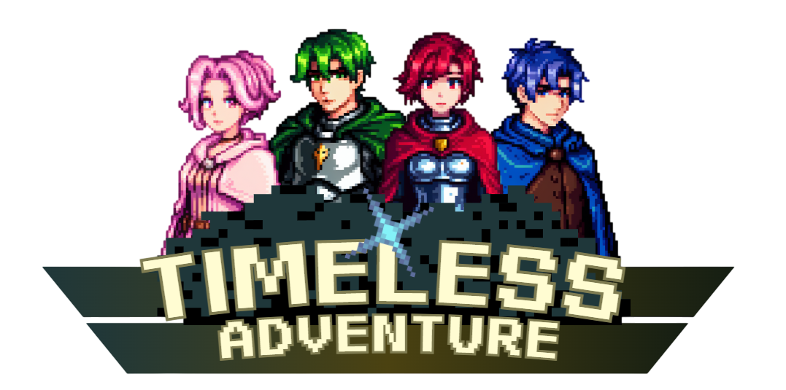
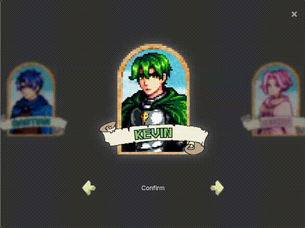
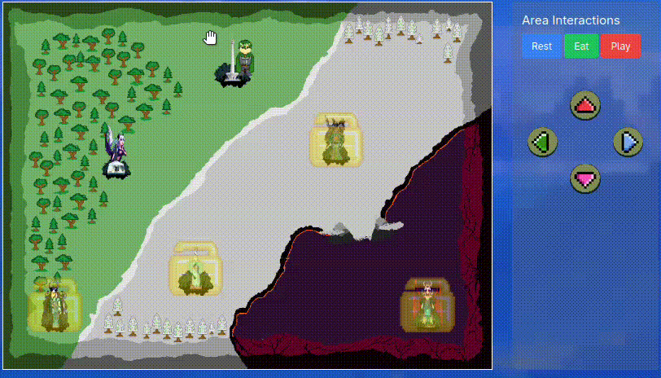

  <h1>Timeless Adventure</h1>
  
  <h2><strong><i>"It's Not Just a Game"</i></strong></h2>

# The Timeless Incorporated (Group name)
- Clemens Putra Kusmeri (Lead Game Developer)
- Naomi Patricia Leandru (Game Developer)
- Fransiskus Bonifasius Tanoewidjojo (Asset Creator)
- Darren (Music & Asset Creator)

# Features
## Avatar Selection

You can select an avatar for your game, each character are tailored with their own story! So choose wisely on who to pick!

  <h3>Available Characters</h3>
  
Kevin

  
Regina

  
Lina

  
Bastian

## Movement

We have 5 movement mechanics to make sure that every device can enjoy the game!

You can **drag and drop** the character into a different area, **click a different area**, press the **in-game arrow** on the Area Interactions. For desktop users, you can use **arrow keys** and/or **WASD keys**.

## Stats

<footer align="center" style="font-family: monospace;">
  ~ Where memories are unharmed. Where the most precious pieces of memories seem to stay with you forever. You will appreciate every single piece of it before it happens. ~
</footer>